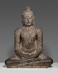
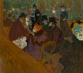
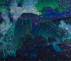
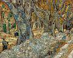
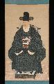
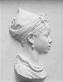
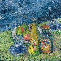
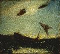

# Art Breaker 3000 Credits

## Software used

This app was developed using [Godot](https://godotengine.org/), an open source game engine. [Python](https://www.python.org/) was used to pre-process collection data and images.

## Audio used

All music and sounds courtesy of public domain music by [Komiku](https://freemusicarchive.org/music/Komiku/) via the [Free Music Archive](https://freemusicarchive.org/) from albums [Captain Glouglou's Incredible Week Soundtrack](https://freemusicarchive.org/music/Komiku/Captain_Glouglous_Incredible_Week_Soundtrack) and [Helice Awesome Dance Adventure !!](https://freemusicarchive.org/music/Komiku/Helice_Awesome_Dance_Adventure_).

## Artwork used

Public domain artworks courtesy of [The Art Institute of Chicago](https://www.artic.edu/), [The Cleveland Art Museum](https://www.clevelandart.org/), [The Metropolitan Museum of Art](https://www.metmuseum.org/), [The National Gallery of Art](https://www.nga.gov/), and [The Smithsonian Institution](https://www.si.edu/).

| Thumbnail | Title | Creator | Date | Source |
| --------- | ----- | ------- | ---- | ------ |
|  | [The Bedroom](https://www.artic.edu/artworks/28560/the-bedroom) | Vincent van Gogh | 1889 | The Art Institute of Chicago |
|  | [Buddha Shakyamuni Seated in Meditation (Dhyanamudra)](https://www.artic.edu/artworks/21023/buddha-shakyamuni-seated-in-meditation-dhyanamudra) | Unknown | 1101 | The Art Institute of Chicago |
|  | [Under the Wave off Kanagawa (Kanagawa oki nami ura)](https://www.artic.edu/artworks/24645/under-the-wave-off-kanagawa-kanagawa-oki-nami-ura-also-known-as-the-great-wave-from-the-series-thirty-six-views-of-mount-fuji-fugaku-sanj%E7%AC%9Brokkei) | Katsushika Hokusai | 1826 | The Art Institute of Chicago |
|  | [At the Moulin Rouge](https://www.artic.edu/artworks/61128/at-the-moulin-rouge) | Henri de Toulouse-Lautrec | 1892 | The Art Institute of Chicago |
|  | [The Girl by the Window](https://www.artic.edu/artworks/154235/the-girl-by-the-window) | Edvard Munch | 1893 | The Art Institute of Chicago |
|  | [Interrupted Reading](https://www.artic.edu/artworks/81512/interrupted-reading) | Jean Baptiste Camille Corot | 1865 | The Art Institute of Chicago |
|  | [Madame Cezanne in a Yellow Chair](https://www.artic.edu/artworks/62371/madame-cezanne-in-a-yellow-chair) | Paul Cezanne | 1893 | The Art Institute of Chicago |
|  | [Merahi metua no Tehamana](https://www.artic.edu/artworks/60812/merahi-metua-no-tehamana-tehamana-has-many-parents-or-the-ancestors-of-tehamana) | Paul Gauguin | 1893 | The Art Institute of Chicago |
|  | [Head of an Apostle](https://www.artic.edu/artworks/50909/head-of-an-apostle) | Unknown | 1200 | The Art Institute of Chicago |
|  | [Evening Snow on a Floss Shaper (Nurioke no bosetsu)](https://www.artic.edu/artworks/88977/evening-snow-on-a-floss-shaper-nurioke-no-bosetsu-from-the-series-eight-views-of-the-parlor-zashiki-hakkei) | Suzuki Harunobu | 1761 | The Art Institute of Chicago |
|  | [Head](https://www.artic.edu/artworks/187528/head) | Fang | 1850 | The Art Institute of Chicago |
|  | [A Monumental Portrait of a Monkey](https://www.artic.edu/artworks/210511/a-monumental-portrait-of-a-monkey) | Stipple Master | 1700 | The Art Institute of Chicago |
|  | [Green and Blue: The Dancer](https://www.artic.edu/artworks/111164/green-and-blue-the-dancer) | James McNeill Whistler | 1888 | The Art Institute of Chicago |
|  | [The actor Bando Mitsugoro II as Ishii Genzo](https://www.artic.edu/artworks/89856/the-actor-bando-mitsugoro-ii-as-ishii-genzo) | Tōshūsai Sharaku | 1794 | The Art Institute of Chicago |
|  | [Landscape with Two Poplars](https://www.artic.edu/artworks/8980/landscape-with-two-poplars) | Vasily Kandinsky | 1912 | The Art Institute of Chicago |
|  | [The Bewitched Mill](https://www.artic.edu/artworks/9021/the-bewitched-mill) | Franz Marc | 1913 | The Art Institute of Chicago |
|  | [Abstract Portrait Vessel of a Ruler with Painted Face Resting on Feet](https://www.artic.edu/artworks/8746/abstract-portrait-vessel-of-a-ruler-with-painted-face-resting-on-feet) | Moche | 100 BCE | The Art Institute of Chicago |
|  | [June (recto)](https://www.clevelandart.org/art/1950.397.a) | William Sommer | c. 1926 | Cleveland Art Museum |
|  | [Church Street El](https://www.clevelandart.org/art/1977.43) | Charles Sheeler | 1920 | Cleveland Art Museum |
|  | [Rock at Sea](https://www.clevelandart.org/art/2009.269) | Raymond Jonson | 1920–1922 | Cleveland Art Museum |
|  | [The Blue Feather](https://www.clevelandart.org/art/1917.400) | William J. Edmondson | 1917 | Cleveland Art Museum |
|  | [Valley of the Sédelle at Pont Charraud: White Frost](https://www.clevelandart.org/art/1964.282) | Armand Guillaumin | c.1903–1911 | Cleveland Art Museum |
|  | [The Contemplator](https://www.clevelandart.org/art/1946.283) | Eugène Carrière | 1901 | Cleveland Art Museum |
|  | [Kangaroo](https://www.clevelandart.org/art/1982.113) | Unknown | 1900s | Cleveland Art Museum |
|  | [Rider and four-legged bovine creature in mauve, chartreuse and black palette](https://www.clevelandart.org/art/2005.83) | Unknown | 1900s | Cleveland Art Museum |
|  | [The Pink Cloud](https://www.clevelandart.org/art/2020.106) | Henri-Edmond Cross | c. 1896 | Cleveland Art Museum |
|  | [In the Waves (Dans les Vagues)](https://www.clevelandart.org/art/1978.63) | Paul Gauguin | 1889 | Cleveland Art Museum |
|  | [The Large Plane Trees (Road Menders at Saint-Rémy)](https://www.clevelandart.org/art/1947.209) | Vincent van Gogh | 1889 | Cleveland Art Museum |
|  | [Lakshmi and Sarasvati](https://www.clevelandart.org/art/2003.121) | Unknown | c. 1890 | Cleveland Art Museum |
|  | [The Music Party](https://www.clevelandart.org/art/1994.286) | Elihu Vedder | c. 1875 | Cleveland Art Museum |
|  | [An October Day](https://www.clevelandart.org/art/1924.963) | Frank K. M. Rehn | before 1915 | Cleveland Art Museum |
|  | [Head of an Italian Woman](https://www.clevelandart.org/art/1980.264) | Jean-Léon Gérôme | c. 1847 | Cleveland Art Museum |
|  | [Nathaniel Olds](https://www.clevelandart.org/art/1991.134.2) | Jeptha Homer Wade | 1837 | Cleveland Art Museum |
|  | [Minamoto no Yoshitsune](https://www.clevelandart.org/art/1919.914) | Unknown | 1800–1868 | Cleveland Art Museum |
|  | [Gaudi Ragini, page from a Ragamala series](https://www.clevelandart.org/art/1975.40) | Unknown | c. 1780–1800 | Cleveland Art Museum |
|  | [Thirty-Six Poetic Immortals](https://www.clevelandart.org/art/1960.183) | Tatebayashi Kagei | mid 1700s | Cleveland Art Museum |
|  | [Celebrations of Krishna's Birth, from a Bhagavata Purana](https://www.clevelandart.org/art/1988.70) | Unknown | c. 1725–30 | Cleveland Art Museum |
|  | [Repose](https://www.metmuseum.org/art/collection/search/10065) | John White Alexander | 1895 | The Metropolitan Museum of Art |
|  | [The Adoration of the Magi](https://www.metmuseum.org/art/collection/search/458956) | Bartolo di Fredi | ca. 1390 | The Metropolitan Museum of Art |
|  | [Mäda Primavesi](https://www.metmuseum.org/art/collection/search/436819) | Gustav Klimt | 1912–13 | The Metropolitan Museum of Art |
|  | [Study for A Sunday on La Grande Jatte](https://www.metmuseum.org/art/collection/search/437658) | Georges Seurat | 1884 | The Metropolitan Museum of Art |
|  | [Winter Scene in Moonlight](https://www.metmuseum.org/art/collection/search/16577) | Henry Farrer | 1869 | The Metropolitan Museum of Art |
|  | [A Rose](https://www.metmuseum.org/art/collection/search/14931) | Thomas Anshutz | 1907 | The Metropolitan Museum of Art |
|  | [Mrs. Mayer and Daughter](https://www.metmuseum.org/art/collection/search/11764) | Ammi Phillips | 1835–40 | The Metropolitan Museum of Art |
|  | [Molly Wales Fobes](https://www.metmuseum.org/art/collection/search/11040) | Rufus Hathaway | 1790 | The Metropolitan Museum of Art |
|  | [The Toilers of the Sea](https://www.metmuseum.org/art/collection/search/11981) | Albert Pinkham Ryder | ca. 1880–85 | The Metropolitan Museum of Art |
|  | [The Veteran in a New Field](https://www.metmuseum.org/art/collection/search/11145) | Winslow Homer | 1865 | The Metropolitan Museum of Art |
|  | [Lake George and the Village of Caldwell](https://www.metmuseum.org/art/collection/search/18354) | Thomas Chambers | ca. 1850s | The Metropolitan Museum of Art |
|  | [The Musicians](https://www.metmuseum.org/art/collection/search/435844) | Caravaggio (Michelangelo Merisi) | 1597 | The Metropolitan Museum of Art |
|  | [Juan de Pareja](https://www.metmuseum.org/art/collection/search/437869) | Velázquez (Diego Rodríguez de Silva y Velázquez) | 1650 | The Metropolitan Museum of Art |
|  | [Still Life with Teapot and Fruit](https://www.metmuseum.org/art/collection/search/437999) | Paul Gauguin | 1896 | The Metropolitan Museum of Art |
|  | [Sunset on the Sea](https://www.metmuseum.org/art/collection/search/11325) | John Frederick Kensett | 1872 | The Metropolitan Museum of Art |
|  | [The Dance Class](https://www.metmuseum.org/art/collection/search/438817) | Edgar Degas | 1874 | The Metropolitan Museum of Art |
|  | [Northeaster](https://www.metmuseum.org/art/collection/search/11130) | Winslow Homer | 1895; reworked by 1901 | The Metropolitan Museum of Art |
|  | [Manuel Osorio Manrique de Zuñiga](https://www.metmuseum.org/art/collection/search/436545) | Goya (Francisco de Goya y Lucientes) | 1787–88 | The Metropolitan Museum of Art |
|  | [The Fortune-Teller](https://www.metmuseum.org/art/collection/search/436838) | Georges de La Tour | probably 1630s | The Metropolitan Museum of Art |
|  | [Wheat Field with Cypresses](https://www.metmuseum.org/art/collection/search/436535) | Vincent van Gogh | 1889 | The Metropolitan Museum of Art |
|  | [Still Life with Apples and a Pot of Primroses](https://www.metmuseum.org/art/collection/search/435882) | Paul Cézanne | ca. 1890 | The Metropolitan Museum of Art |
|  | [Study of a Young Woman](https://www.metmuseum.org/art/collection/search/437879) | Johannes Vermeer | ca. 1665–67 | The Metropolitan Museum of Art |
|  | [Self-Portrait with a Straw Hat](https://www.metmuseum.org/art/collection/search/436532) | Vincent van Gogh | 1887 | The Metropolitan Museum of Art |
|  | [A Goldsmith in his Shop](https://www.metmuseum.org/art/collection/search/459052) | Petrus Christus | 1449 | The Metropolitan Museum of Art |
|  | [Irises](https://www.metmuseum.org/art/collection/search/436528) | Vincent van Gogh | 1890 | The Metropolitan Museum of Art |
|  | [Circus Sideshow (Parade de cirque)](https://www.metmuseum.org/art/collection/search/437654) | Georges Seurat | 1887–88 | The Metropolitan Museum of Art |
|  | [Portrait of Yun Dongseom](https://www.metmuseum.org/art/collection/search/656430) | Unidentified artist | ca. 1790–1805 | The Metropolitan Museum of Art |
|  | [A Lady Playing the Tanpura](https://www.metmuseum.org/art/collection/search/38038) | Unknown | ca. 1735 | The Metropolitan Museum of Art |
|  | [Rough Waves](https://www.metmuseum.org/art/collection/search/44918) | Ogata Kōrin | ca. 1704–9 | The Metropolitan Museum of Art |
|  | [Buddha Shakyamuni as Lord of the Munis](https://www.metmuseum.org/art/collection/search/75274) | Unknown | mid-17th century | The Metropolitan Museum of Art |
|  | [Channel Bass](https://www.metmuseum.org/art/collection/search/11114) | Winslow Homer | 1904 | The Metropolitan Museum of Art |
|  | [Armor](https://www.metmuseum.org/art/collection/search/339671) | Odilon Redon | 1891 | The Metropolitan Museum of Art |
|  | [Corridor in the Asylum](https://www.metmuseum.org/art/collection/search/336327) | Vincent van Gogh | September 1889 | The Metropolitan Museum of Art |
|  | [Little Ida](https://www.metmuseum.org/art/collection/search/10360) | Charles Calverley | 1869; carved 1881 | The Metropolitan Museum of Art |
|  | [Lady Lilith](https://www.metmuseum.org/art/collection/search/337500) | Dante Gabriel Rossetti | 1867 | The Metropolitan Museum of Art |
|  | [Serape](https://www.metmuseum.org/art/collection/search/823660) | Unidentified | ca. 1840–50 | The Metropolitan Museum of Art |
|  | [Basin](https://www.metmuseum.org/art/collection/search/674) | Master Potter A | ca. 1650 | The Metropolitan Museum of Art |
|  | [The Lovers](https://www.metmuseum.org/art/collection/search/451023) | Riza-yi 'Abbasi | dated 1039 AH/1630 CE | The Metropolitan Museum of Art |
|  | [Saint Anthony Abbot](https://www.metmuseum.org/art/collection/search/469913) | Nikolaus von Hagenau | ca. 1500 | The Metropolitan Museum of Art |
|  | [Head of Bhairava](https://www.metmuseum.org/art/collection/search/78187) | Unknown | 16th century | The Metropolitan Museum of Art |
|  | [The Unicorn Rests in a Garden](https://www.metmuseum.org/art/collection/search/467642) | Unknown | 1495–1505 | The Metropolitan Museum of Art |
|  | [Fragment of a Tapestry or Wall Hanging](https://www.metmuseum.org/art/collection/search/466178) | Unknown | ca. 1420–30 | The Metropolitan Museum of Art |
|  | [Jonah and the Whale](https://www.metmuseum.org/art/collection/search/453683) | Unknown | ca. 1400 | The Metropolitan Museum of Art |
|  | [Panel with Peonies and Butterfly](https://www.metmuseum.org/art/collection/search/39735) | Unknown | late 14th–15th century | The Metropolitan Museum of Art |
|  | [Textile with Animals, Birds, and Flowers](https://www.metmuseum.org/art/collection/search/39737) | Unknown | late 12th–14th century | The Metropolitan Museum of Art |
|  | [Portrait of the Indian Monk Atisha](https://www.metmuseum.org/art/collection/search/38006) | Unknown | early to mid-12th century | The Metropolitan Museum of Art |
|  | [Brahma](https://www.metmuseum.org/art/collection/search/38265) | Unknown | first quarter of the 10th century | The Metropolitan Museum of Art |
|  | [Relief with Enthroned Ruler](https://www.metmuseum.org/art/collection/search/313240) | Chakalte' | early 770s | The Metropolitan Museum of Art |
|  | [Buddha, probably Amitabha](https://www.metmuseum.org/art/collection/search/42163) | Unknown | early 7th century | The Metropolitan Museum of Art |
|  | [Ear Ornament, Winged Runner](https://www.metmuseum.org/art/collection/search/309428) | Unknown | 400–700 CE | The Metropolitan Museum of Art |
|  | [Panel with striding lion](https://www.metmuseum.org/art/collection/search/322585) | Unknown | ca. 604–562 BCE | The Metropolitan Museum of Art |
|  | [Marble akroterion](https://www.metmuseum.org/art/collection/search/250951) | Unknown | ca. 350–325 BCE | The Metropolitan Museum of Art |
|  | [Terracotta Panathenaic prize amphora](https://www.metmuseum.org/art/collection/search/248902) | Euphiletos Painter | ca. 530 BCE | The Metropolitan Museum of Art |
|  | [Ginevra de' Benci [obverse]](https://www.nga.gov/collection/art-object-page.50724.html) | Leonardo da Vinci | 1474 | National Gallery of Art |
|  | [Portrait of a Lady](https://www.nga.gov/collection/art-object-page.51.html) | Rogier van der Weyden | 1460 | National Gallery of Art |
|  | [The Concert](https://www.nga.gov/collection/art-object-page.163184.html) | Gerrit van Honthorst | 1623 | National Gallery of Art |
|  | [The Boating Party](https://www.nga.gov/collection/art-object-page.46569.html) | Mary Cassatt | 1893 | National Gallery of Art |
|  | [The Japanese Footbridge](https://www.nga.gov/collection/art-object-page.74796.html) | Claude Monet | 1899 | National Gallery of Art |
|  | [Baby (Cradle)](https://www.nga.gov/collection/art-object-page.56662.html) | Gustav Klimt | 1917 | National Gallery of Art |
|  | [Café Singer](https://www.nga.gov/collection/art-object-page.46519.html) | Amedeo Modigliani | 1917 | National Gallery of Art |
|  | [Glass and Checkerboard](https://www.nga.gov/collection/art-object-page.166491.html) | Juan Gris | 1917 | National Gallery of Art |
|  | [The Visit - Couple and Newcomer](https://www.nga.gov/collection/art-object-page.71239.html) | Ernst Ludwig Kirchner | 1922 | National Gallery of Art |
|  | [Palazzo da Mula, Venice](https://www.nga.gov/collection/art-object-page.46657.html) | Claude Monet | 1908 | National Gallery of Art |
|  | [The Equatorial Jungle](https://www.nga.gov/collection/art-object-page.46688.html) | Henri Rousseau | 1909 | National Gallery of Art |
|  | [The Bathers](https://www.nga.gov/collection/art-object-page.108617.html) | Roger de La Fresnaye | 1912 | National Gallery of Art |
|  | [The Basket of Flowers](https://www.nga.gov/collection/art-object-page.46622.html) | Frederick Carl Frieseke | 1913 | National Gallery of Art |
|  | [Political Drama](https://www.nga.gov/collection/art-object-page.52397.html) | Robert Delaunay | 1914 | National Gallery of Art |
|  | [Salem Cove](https://www.nga.gov/collection/art-object-page.66431.html) | Maurice Prendergast | 1915 | National Gallery of Art |
|  | [Denise Maréchal](https://www.nga.gov/collection/art-object-page.219555.html) | Théo van Rysselberghe | 1894 | National Gallery of Art |
|  | [Boy on the Rocks](https://www.nga.gov/collection/art-object-page.46538.html) | Henri Rousseau | 1895 | National Gallery of Art |
|  | [Marcelle Lender Dancing the Bolero in Chilpéric](https://www.nga.gov/collection/art-object-page.72012.html) | Henri de Toulouse-Lautrec | 1895 | National Gallery of Art |
|  | [Four Dancers](https://www.nga.gov/collection/art-object-page.46597.html) | Edgar Degas | 1899 | National Gallery of Art |
|  | [Young Spanish Woman with a Guitar](https://www.nga.gov/collection/art-object-page.52220.html) | Auguste Renoir | 1898 | National Gallery of Art |
|  | [Still Life with Bottles and Fruit](https://www.nga.gov/collection/art-object-page.130841.html) | Alexej von Jawlensky | 1900 | National Gallery of Art |
|  | [The Houses of Parliament, Sunset](https://www.nga.gov/collection/art-object-page.46523.html) | Claude Monet | 1903 | National Gallery of Art |
|  | [Study of Lilia](https://www.nga.gov/collection/art-object-page.108382.html) | Carolus-Duran | 1887 | National Gallery of Art |
|  | [Young Girl Reading](https://www.nga.gov/collection/art-object-page.52215.html) | Auguste Renoir | 1888 | National Gallery of Art |
|  | [Self-Portrait](https://www.nga.gov/collection/art-object-page.106382.html) | Vincent van Gogh | 1889 | National Gallery of Art |
|  | [Law of the Wild](https://www.nga.gov/collection/art-object-page.52956.html) | Charles S. Raleigh | 1881 | National Gallery of Art |
|  | [Lemons](https://www.nga.gov/collection/art-object-page.214122.html) | George Henry Hall | 1884 | National Gallery of Art |
|  | [Woman with a Parasol - Madame Monet and Her Son](https://www.nga.gov/collection/art-object-page.61379.html) | Claude Monet | 1875 | National Gallery of Art |
|  | [Little Girl in a Blue Armchair](https://www.nga.gov/collection/art-object-page.61368.html) | Mary Cassatt | 1878 | National Gallery of Art |
|  | [Madame Camus](https://www.nga.gov/collection/art-object-page.46596.html) | Edgar Degas | 1869 | National Gallery of Art |
|  | [Flowers and Fruit](https://www.nga.gov/collection/art-object-page.42504.html) | American 19th Century | 1870 | National Gallery of Art |
|  | [Girl in Red](https://www.nga.gov/collection/art-object-page.46492.html) | Edgar Degas | 1866 | National Gallery of Art |
|  | [Moonlight](https://www.si.edu/object/moonlight%3Asaam_1909.10.2) | Albert Pinkham Ryder | 1887 | The Smithsonian Institution |
|  | [Portrait of Helen (Lena) Ten Broeck](https://www.si.edu/object/portrait-helen-lena-ten-broeck%3Asaam_2019.6.10) | Ammi Phillips | 1834 | The Smithsonian Institution |
|  | [Neapolitan Song](https://www.si.edu/object/neapolitan-song%3Asaam_2000.11) | Joseph Stella | 1929 | The Smithsonian Institution |
|  | [Quill-Leaf Tillandsia (Tillandsia fasciculata)](https://www.si.edu/object/quill-leaf-tillandsia-tillandsia-fasciculata%3Asaam_1970.355.736) | Mary Vaux Walcott | 1929 | The Smithsonian Institution |
|  | [Frida Kahlo](https://www.si.edu/object/frida-kahlo%3Anpg_NPG.2015.136) | Magda Pach | 1933 | The Smithsonian Institution |
|  | [Lady Mary Victoria Leiter Curzon](https://www.si.edu/object/lady-mary-victoria-leiter-curzon%3Anpg_NPG.96.94) | Mary Victoria Leiter Curzon | 1901 | The Smithsonian Institution |
